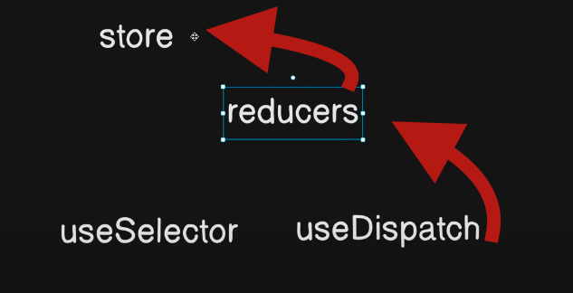

# React + Vite

This template provides a minimal setup to get React working in Vite with HMR and some ESLint rules.

Currently, two official plugins are available:

- [@vitejs/plugin-react](https://github.com/vitejs/vite-plugin-react/blob/main/packages/plugin-react/README.md) uses [Babel](https://babeljs.io/) for Fast Refresh
- [@vitejs/plugin-react-swc](https://github.com/vitejs/vite-plugin-react-swc) uses [SWC](https://swc.rs/) for Fast Refresh

## Setup Redux tool kit
```js
npm install @reduxjs/toolkit

npm install react-redux

```

### Add store form src/app/Store.js
```js

import { configureStore } from '@reduxjs/toolkit';

export const store = configureStore({
    
})
```

## create sclice form src/feattures/demoSclice.js
```javascript

import { createSlice , nanoid } from '@reduxjs/toolkit';

export const demoSlice = createSlice({
    name: 'demo',
    initialState: {
        todos: [{
            id: nanoid(),
            todo: 'Learn React',
            completed: false
        }],
    },
    responses:{
        addTodo: (state, action) => {
            state.todos.push({
                id: nanoid(),
                todo: action.payload,
                completed: false
            })
        },
        // remove
        removeTodo: (state, action) => {
            state.todos = state.todos.filter((todo) => todo.id !== action.payload)
        },
        // update todo
        updateTodo: (state, action) => {
            state.todos = state.todos.map((todo) => {
                if (todo.id === action.payload.id) {
                    return {
                        ...todo,
                        todo: action.payload.todo
                    }
                }
                return todo
            })
        }
    }
    
    
})

export const { addTodo, removeTodo, updateTodo } = demoSlice.actions;

export default demoSlice.reducer

```

### reducers have 2 values  state and action 

####  state give thw access to the  initial state values

####  action give thw access to the  action values
### export the all funcility of the sclice from src/feattures/demoSclice.js
###  export the reducer to access the store funcility 


## now declare the reducer and use it in the store
```js

import { configureStore } from '@reduxjs/toolkit';
import demoReducer from './feattures/demoSclice';

export const store = configureStore({
    reducer: {
        demo: demoReducer
    }
})

```

## now  learn useSelector and useDispatch
### useSelector give the access to the state values
### useDispatch give the access to the action values
### this two are react classes that give the access to the state and action values in redux

```js

import { useSelector, useDispatch } from 'react-redux';

 const useDispatch =useDispatch()

 const todos = useSelector((state) => state.demo.todos)

```



```js

import { useSelector, useDispatch } from 'react-redux';

 const useDispatch =useDispatch()

const addTodoHandler =(e) => {
    e.preventDefault();
    useDispatch(addTodo(input))
    
}

```